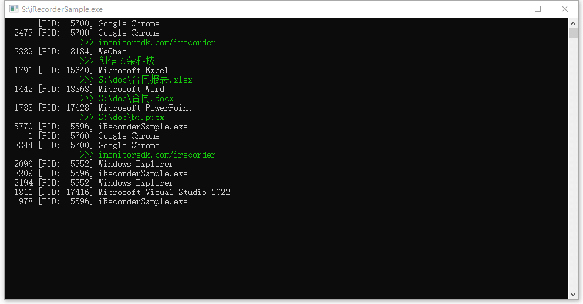

## 简介

**iRecorderSDK** 是一款用于记录终端软件使用时间的开发套件。

可以方便的统计用户软件、上网、操作文档、聊天的使用时间。适用于软件行为分析、上网行为分析等效率软件。可以分析工作是否频繁被打断，从而制定提供工作效率的软件。希望可以为远程工作建立一种信任机制，从而让远程工作可以更加普及。

> iRecorderSDK 跟 [iMonitorSDK](https://iMonitorSDK.com) 的区别在于：一个是统计使用时间，一个是监控操作行为。

### ✨ 具备如下特点

- 监听软件的使用切换过程
- 支持识别浏览器正在访问的网址
- 支持识别Office正在操作的文档
- 支持识别聊天工具正在聊天的对象
- 使用旁路模式，不需要注入其他进程，百分百安全稳定
- 支持扩展，如果需要识别更多的软件操作行为，可以通过扩展来识别

### 📦 适用于如下的产品

- 软件行为分析
- 上网行为分析
- 效率软件
- 终端管理系统
- 零信任远程办公系统

## 🔨 快速入门

```c++
class RecorderCallback : public IWindowMonitorCallback
{
public:
	RecorderCallback()
	{
		m_ConsoleHandle = GetStdHandle(STD_OUTPUT_HANDLE);
	}

	void OnWindowChanged(WindowInfo* window, WindowInfo* new_window) override
	{
		if (!window->Window || !window->Process)
			return;

		LPCWSTR process_info = window->Process->FileDescription;
		if (!process_info || !process_info[0]) {
			process_info = window->Process->ProcessName;
		}

		printf("%6d [PID:%6d] %S\n", window->Duration, window->ProcessId, process_info);

		if (window->ExtensionType != emWindowExtensionNone) {
			SetConsoleTextAttribute(m_ConsoleHandle, FOREGROUND_GREEN | FOREGROUND_INTENSITY);
			printf("\t\t>>> %S\n", window->ExtensionUrl);
			SetConsoleTextAttribute(m_ConsoleHandle, FOREGROUND_RED | FOREGROUND_GREEN | FOREGROUND_BLUE);
		}
	}

	void OnWindowContinued(WindowInfo* window) override
	{
	}

protected:
	HANDLE m_ConsoleHandle = NULL;
};

int main(int argc, const char* argv[])
{
	setlocale(LC_ALL, "");

	Recorder recoder;

	HRESULT hr = recoder.Initialize();

	if (hr != S_OK)
		return 0;

	RecorderCallback callback;
	hr = recoder.StartWindowMonitor(&callback);

	if (hr != S_OK)
		return 0;

	WaitForSingleObject(GetCurrentThread(), INFINITE);

	recoder.StopWindowMonitor();

	return 0;
}
```



## 使用授权

任何合法的软件都可以免费使用本SDK，同时自行承担由此引发的隐私争议、其他未知风险。

对于需要源码的，可以联系 admin@iMonitorSDK.com 购买。

## 使用本SDK的产品

- [iRecorder 冰鉴 - 软件使用分析系统](https://imonitorsdk.com/irecorder)

## [关于我们](https://imonitorsdk.com/about)
